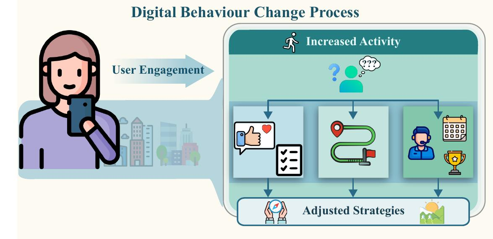

# [Ambivalence/Hesitancy Recognition in Videos for Personalized Digital Health Interventions](https://arxiv.org/pdf/2604.11730)


by
**Manuela González-González<sup>3,4</sup>,
Soufiane Belharbi<sup>1</sup>,
Muhammad Osama Zeeshan<sup>1</sup>,
Masoumeh Sharafi<sup>1</sup>,
Muhammad Haseeb Aslam<sup>1</sup>,
Lorenzo Sia<sup>1</sup>,
Nicolas Richet<sup>1</sup>,
Alessandro Lameiras Koerich<sup>2</sup>,
Marco Pedersoli<sup>1</sup>,
Simon L. Bacon<sup>3,4</sup> &
Eric Granger<sup>1</sup>**

<sup>1</sup> LIVIA, Dept. of Systems Engineering, ETS Montreal, Canada
<br/>
<sup>2</sup> LIVIA, Dept. of Software and IT Engineering, ETS Montreal, Canada
<br/>
<sup>3</sup> Dept. of Health, Kinesiology, \& Applied Physiology, Concordia University, Montreal, Canada
<br/>
<sup>4</sup> Montreal Behavioural Medicine Centre, CIUSSS Nord-de-l’Ile-de-Montréal, Canada


<p align="center"></p>


[](https://arxiv.org/pdf/2604.11730)

## Abstract
Using behavioural science, health interventions focus on behaviour change by
providing a framework to help patients acquire and maintain healthy habits that
improve medical outcomes. In-person interventions are costly and difficult to
scale, especially in resource-limited regions. Digital health interventions
offer a cost-effective approach, potentially supporting independent living and
self-management. Automating such interventions, especially through machine
learning, has gained considerable attention recently.
Ambivalence and hesitancy (A/H) play a primary role for individuals to delay,
avoid, or abandon health interventions. A/H are subtle and conflicting emotions
that place a person in a state between positive and negative evaluations of a
behaviour, or between acceptance and refusal to engage in it. They manifest as
affective inconsistency across modalities or within a modality, such as language,
facial, vocal expressions, and body language.  While experts can be trained to
recognize A/H, as done for in-person interactions, integrating them into digital
health interventions is costly and less effective. Automatic A/H recognition is
therefore critical for the personalization and cost-effectiveness of digital
health interventions.
In this paper, we explore the application of deep learning models for A/H
recognition in videos, a multi-modal task by nature. In particular, this paper
covers three learning setups: supervised learning, unsupervised domain adaptation
for personalization, and zero-shot inference via large language models (LLMs).
Our experiments are conducted on the unique and recently published *BAH* video
dataset for A/H recognition. Our results show limited performance, suggesting
that more adapted multi-modal models are required for accurate A/H recognition.
In addition, better methods for modeling spatio-temporal and multimodal fusion
are necessary to leverage conflicts within and across modalities.


## Citation:
```
@article{gonzalez-26-ah-digital,
  title={Ambivalence/Hesitancy Recognition in Videos for Personalized Digital Health Interventions},
  author={González-González, M. and  Belharbi, S. and Zeeshan, M.O. and Sharafi, M. and Aslam, M.H. and Sia, L. and Richet, N. and Pedersoli, M. and Koerich, A.L. and Bacon, S.L. and Granger, E.},
  journal={CoRR},
  volume={abs/2604.11730},
  year={2026}
}
```


## Reference code:
* **Supervised Learning**:
  - [https://github.com/sbelharbi/bah-dataset](https://github.com/sbelharbi/bah-dataset) [1]
* **Personalization using Domain Adaptation**:
  - [https://github.com/MasoumehSharafi/TTA-CaP](https://github.com/MasoumehSharafi/TTA-CaP) [2]
  - [https://github.com/osamazeeshan/CLIP-AUTT](https://github.com/osamazeeshan/CLIP-AUTT) [3]
* **Zero-shot Inference: Multimodal Large Language Models**:
  - [https://github.com/sbelharbi/zero-shot-m-llm-bah-prediction](https://github.com/sbelharbi/zero-shot-m-llm-bah-prediction) [1]


[1]: [_"BAH Dataset for Ambivalence/Hesitancy Recognition in Videos for Digital Behavioural Change"_, González et al., ICLR 2026.](https://arxiv.org/pdf/2505.19328)
<br/>
[2]: [_"Test-Time Adaptation via Cache Personalization for Facial Expression Recognition in Videos"_, Sharafi et al., 2026](https://arxiv.org/pdf/2603.21309)
<br/>
[3]: [_"CLIP-AUTT: Test-Time Personalization with Action Unit Prompting for Fine-Grained Video Emotion Recognition"_, Zeeshan et al., 2026](https://arxiv.org/pdf/2603.27999)

### Conclusion

Automating digital health interventions, especially through ML, has gained
significant attention recently.
A/H play a primary role for individuals to delay, avoid, or abandon health
behaviour changes. Automatic and accurate A/H recognition is therefore critical
for the personalization and cost-effectiveness of digital behaviour change interventions.

We explored, in this work, the application of deep learning models for the task
of A/H recognition in videos. We cover three learning scenarios: supervised learning,
unsupervised domain adaptation for personalization, and zero-shot inference via LLMs.
Our experiments are conducted on the unique and recently published dataset *BAH*
for A/H recognition. Our results showed that existing models have limited
performance. This suggests that more adapted multi-modal models are required for
accurate A/H recognition. Moreover, better ways to model spatio-temporal and
modality fusion are necessary to detect within and cross-modality conflicts.


### Acknowledgments
This work was supported in part by the Fonds de recherche du Québec – Santé, the Natural Sciences and Engineering Research Council of Canada, Canada Foundation for Innovation, and the Digital Research Alliance of Canada. We thank interns that participated in the dataset annotation: Jessica Almeida (Concordia University, Université du Québec à Montréal), and Laura Lucia Ortiz (MBMC).
